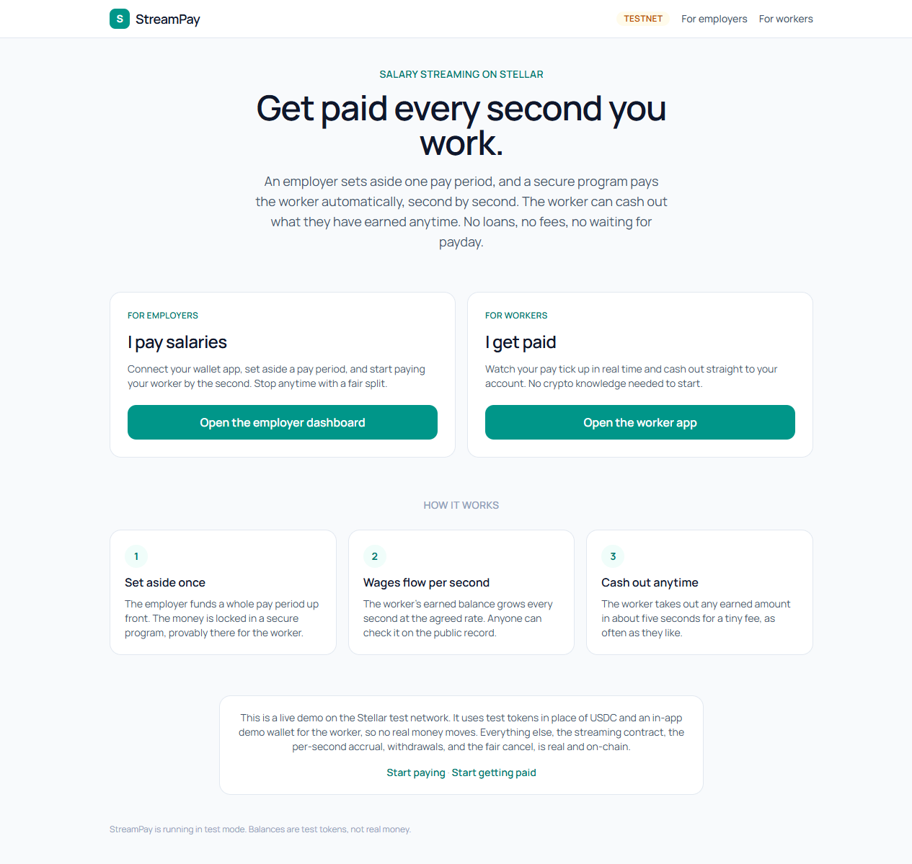
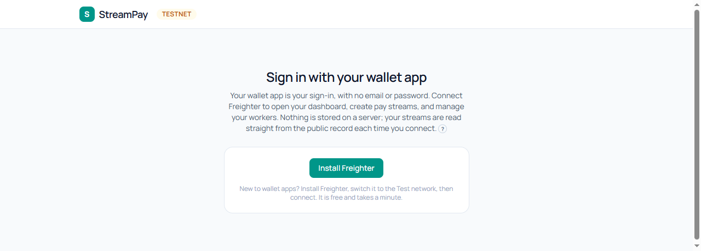
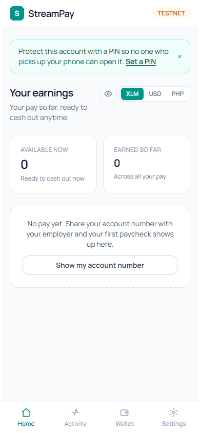
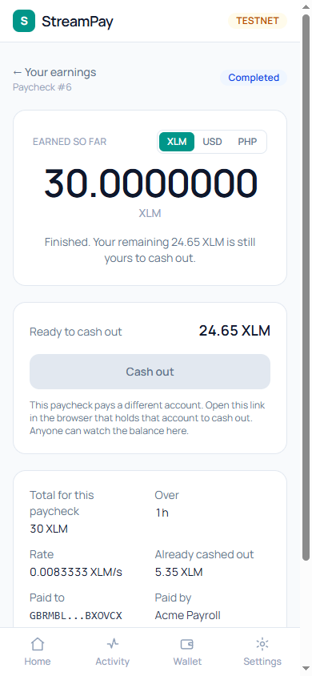

# StreamPay

**Salary that streams, not salary that waits.** An employer sets aside one pay period
and a worker gets paid automatically, second by second, watching the balance grow in
real time and cashing out anytime in about 5 seconds for a tiny fee. Stopping early
splits the money fairly and automatically: everything earned goes to the worker, the
remainder returns to the employer. Neither side needs to know anything about crypto to
use it.

Under the hood it runs on Stellar: the employer deposits into a Soroban smart contract
that streams the funds per second and enforces the fair split, with every payment
verifiable on the public ledger.

Built for the APAC Stellar Hackathon (Payment and Consumer Applications track).

> **Testnet only.** This runs entirely on the Stellar **test** network with friendbot
> funds. No mainnet, no real money.

## Screenshots

| Landing | Employer sign-in |
| --- | --- |
|  |  |

| Worker home | Worker paycheck, live from testnet |
| --- | --- |
|  |  |

## What is real, and what is simplified

Honesty is a feature of this project, not something to hide.

**Real, and verifiable on the public explorer:**

- The streaming smart contract: create, per second accrual, withdraw, and the fair
  cancel split, all enforced on-chain with integer money math (no floats).
- Every money move is an on-chain transaction you can open on stellar.expert.
- The contract has **no admin key, no pause, no drain, and no upgrade hook** by design,
  so "nobody can cheat the rules, not even us" is checkable, not a slogan.

**Simplified for the hackathon demo:**

- Test-XLM stands in for a stablecoin like USDC. The contract is token agnostic (any
  Stellar Asset Contract token), so production is a one-address swap.
- The employer signs with the Freighter browser wallet on testnet; the worker uses an
  in-app testnet demo wallet.

## The contract

Deployed on Stellar testnet:
`CCN6BBCA5PGRXWWYGAEQ4ZLF2QZ3VORKOAGQSETURZINRILNCETB5P3U`
([view on stellar.expert](https://stellar.expert/explorer/testnet/contract/CCN6BBCA5PGRXWWYGAEQ4ZLF2QZ3VORKOAGQSETURZINRILNCETB5P3U))

Four verbs, and nothing more:

- `create_stream(employer, worker, token, deposit, start, duration)`: escrows the whole
  pay period up front and returns a stream id. The full escrow is a worker guarantee: the
  month's wages are provably already on-chain, so the stream cannot run dry mid period.
- `accrued(stream_id)`: earned-so-far = floor(elapsed \* deposit / duration), capped at
  the deposit. Free to read.
- `withdraw(stream_id, amount)`: worker-only, up to accrued minus already withdrawn, any
  amount, any time, no minimum.
- `cancel(stream_id)`: employer-only, pays the worker everything earned to date and
  refunds the rest, leaving the contract holding exactly nothing.

## Architecture

The chain is the backend: one Soroban contract plus one web app, no server and no
database.

```
contracts/streampay/   the Rust + soroban-sdk contract (the money engine)
web/                    the Vite + React + TypeScript + Tailwind app
  src/lib/contract.ts   the single chain boundary (all RPC calls live here)
  src/lib/wallet.ts     the single Freighter boundary
```

## Running it

**Contract** (needs the Rust toolchain and stellar-cli):

```
cd contracts
cargo test
```

**Web app** (needs Node):

```
cd web
npm install
npm run dev      # http://localhost:5173
npm run build    # production bundle
npm test         # unit tests
```

The web app reads its network settings (RPC URL, contract id, token) from one file,
`web/src/lib/config.ts`.

## License

See [LICENSE](LICENSE).
